<!-- Generated from README.md by scripts/build-light-readme.mjs. Do not edit by hand. -->

<div align="center">

<picture>
  <source media="(prefers-color-scheme: dark)" srcset="./docs/assets/adk_dev_logo_light.png">
  
</picture>

# CanteenX

**Order ahead from your campus canteens, pay digitally, watch your order being made, and collect it without queueing.**


<br>


<br><br>

**[Developer documentation](./DEVDOC.md)** · [Features](#features) · [Getting started](#getting-started)

<p><b>Light mode</b> · <a href="./README.md">View this page in dark mode</a></p>

</div>

---

## Contents

- [Why this project matters](#why-this-project-matters)
- [Where it came from](#where-it-came-from)
- [Screenshots](#screenshots)
- [Responsive layout](#responsive-layout)
- [Features](#features)
- [Roles](#roles)
- [The order lifecycle](#the-order-lifecycle)
- [Getting started](#getting-started)
- [Contributors](#contributors)
- [Contributing](#contributing)
- [License](#license)

---

## Why this project matters

The lunch rush on a campus is a queueing problem, not a cooking problem. The kitchen can make a dosa in four minutes; the student spends twenty standing in a line, mostly waiting for the people in front to decide and pay. Ordering ahead removes the line, but only if the app is trustworthy enough that people actually rely on it.

Trustworthy here means specific things, and they are the parts that are easy to get wrong. Prices must come from the server, so a crafted request cannot buy a large coffee at small-coffee prices. An order must not be marked paid because a browser said so; the gateway's signed webhook is the only authority. A status must not be able to jump from pending to completed, or skip backwards, because a vendor tapped the wrong control. And "is this canteen open" has to be computed in campus local time from a weekly schedule, not from whatever timezone the server happens to run in.

CanteenX is built around those constraints, and the code says so: option prices are looked up server-side from the menu, payments settle on a signed idempotent webhook, and the status graph is a literal `dict` of allowed transitions that the ordering service enforces.

## Where it came from

The previous build worked in a demo and failed in the ways that only show up with real users.

The audit that started this rewrite found that **5 of 23 GraphQL queries carried any permission policy at all**, and that `getAllOrders(userId:)` would return any user's order history to an anonymous caller. `Order.status` was a free-text column, so the codebase had written "Pending", "pending", "Paid" and "Completed" for overlapping concepts and no query could filter it reliably. The seed script hardcoded credentials and wrote the placeholder Razorpay key `rzp_test_YOUR_KEY_ID` into every merchant row, which silently switched the whole payment system into a mock that approved everything.

So the rewrite is organised around making those categories of mistake hard to repeat. Permissions are declarative classes that **every** field must name, including `AllowAny`, so an unpoliced field is a visible omission rather than an invisible default. Every status is an enum with an explicit transition table. Prices, customization pricing and totals are computed in one shared module used by both the cart and the order, so a basket and the order it becomes cannot disagree.

## Screenshots

Every image is a real 1440x900 viewport render against a seeded local stack. This page shows **light mode**; the same gallery in dark mode is at **[README.md](./README.md)**.

<table>
  <tr>
    <td width="33%" valign="top">
      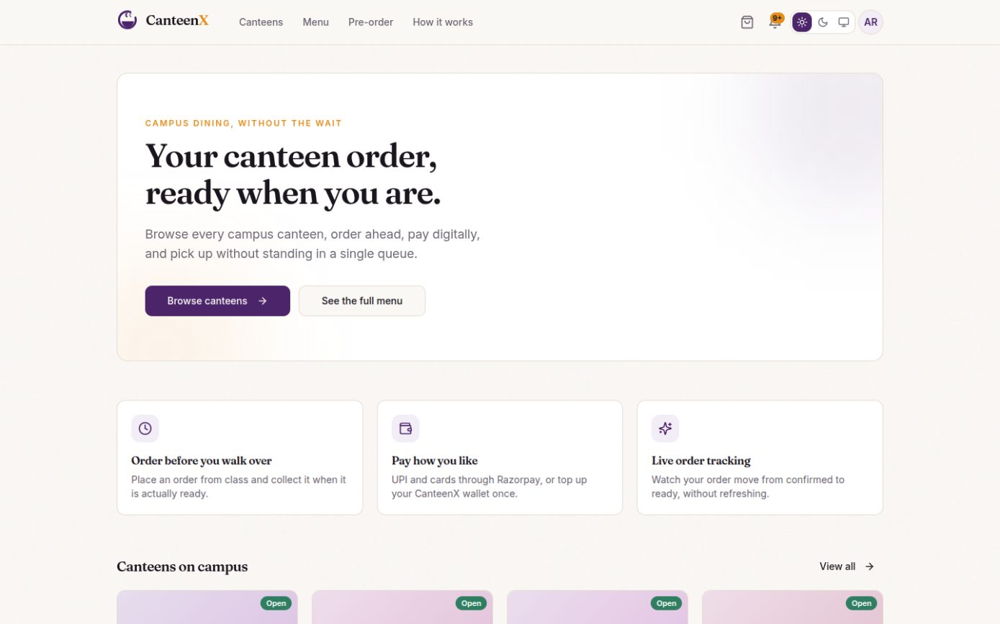
      <p align="center"><b>Home</b><br><sub>Every canteen with live open status, and how it works.</sub></p>
    </td>
    <td width="33%" valign="top">
      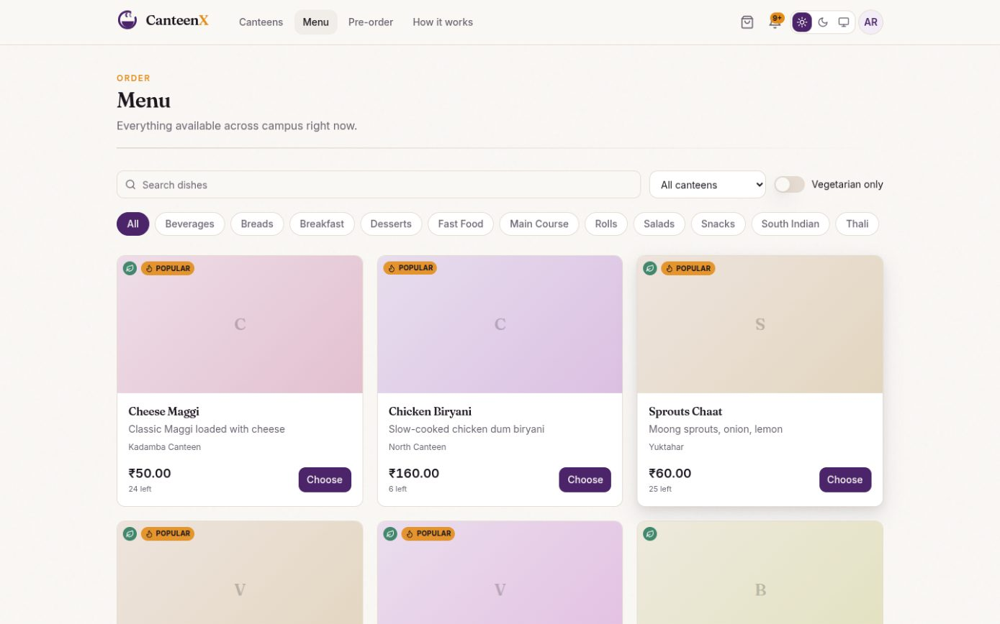
      <p align="center"><b>Menu</b><br><sub>Everything on campus, filterable, with live stock.</sub></p>
    </td>
    <td width="33%" valign="top">
      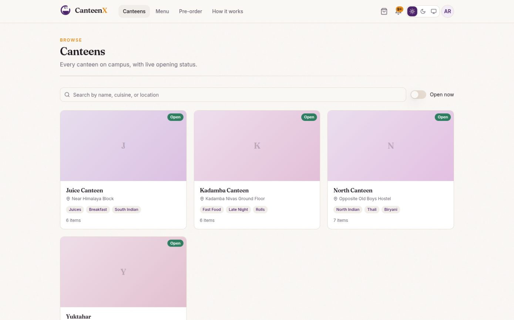
      <p align="center"><b>Canteens</b><br><sub>Search by name, cuisine or location. Open-now filter.</sub></p>
    </td>
  </tr>
  <tr>
    <td width="33%" valign="top">
      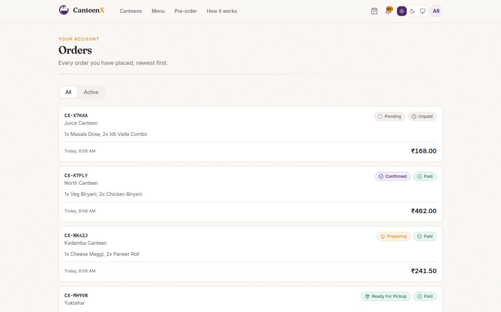
      <p align="center"><b>Your orders</b><br><sub>Every order with its live status and payment state.</sub></p>
    </td>
    <td width="33%" valign="top">
      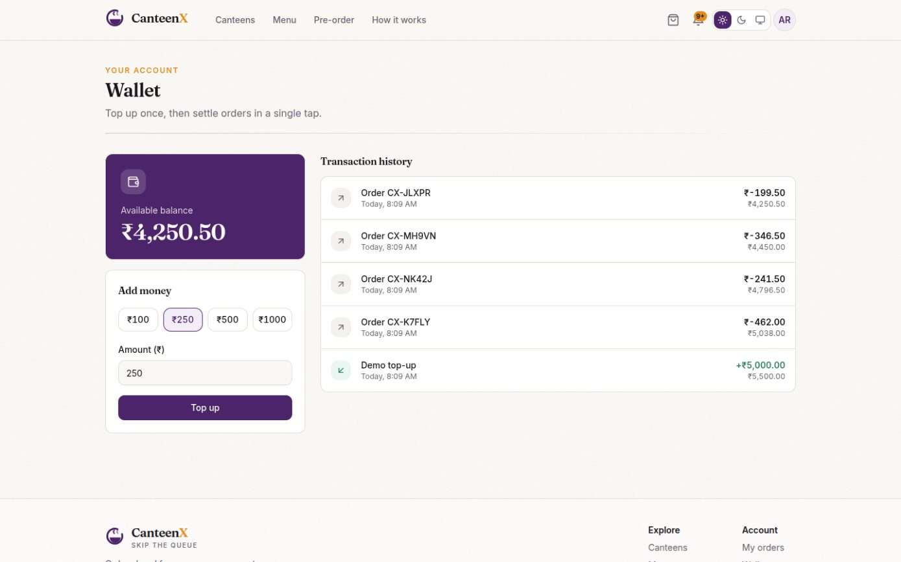
      <p align="center"><b>Wallet</b><br><sub>Top up once, then settle orders in a single tap.</sub></p>
    </td>
    <td width="33%" valign="top">
      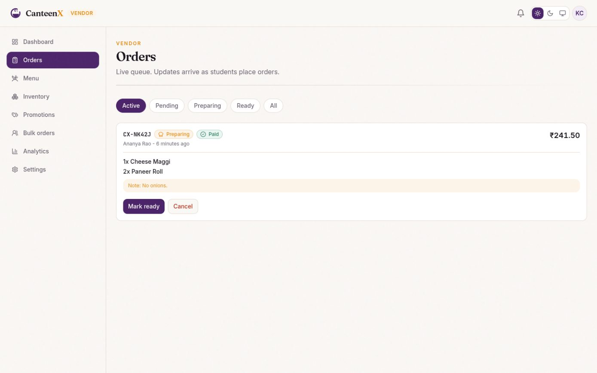
      <p align="center"><b>Kitchen queue</b><br><sub>Live orders, kitchen notes, and only the legal next steps.</sub></p>
    </td>
  </tr>
  <tr>
    <td width="33%" valign="top">
      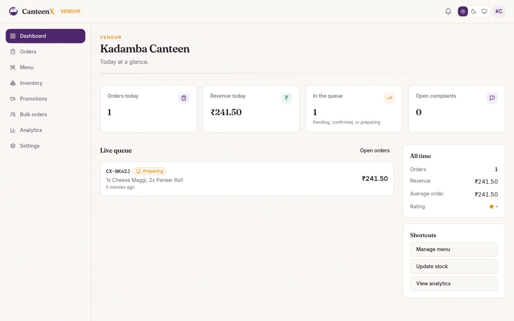
      <p align="center"><b>Vendor dashboard</b><br><sub>Today at a glance, with the live queue beside it.</sub></p>
    </td>
    <td width="33%" valign="top">
      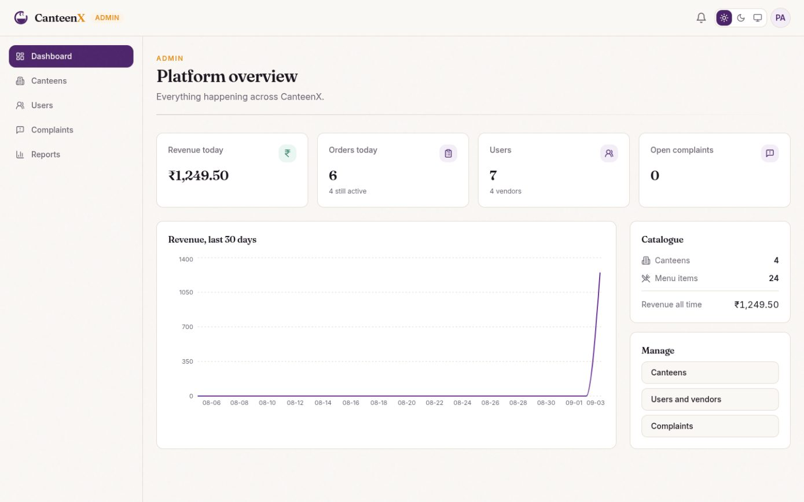
      <p align="center"><b>Admin overview</b><br><sub>Revenue, orders, users and the whole catalogue.</sub></p>
    </td>
    <td width="33%" valign="top">
    </td>
  </tr>
</table>

## Responsive layout

Ordering happens on a phone between lectures, so the phone layout is the one that matters. Each image is its own device viewport.

<table>
  <tr>
    <td width="22%" valign="top">
      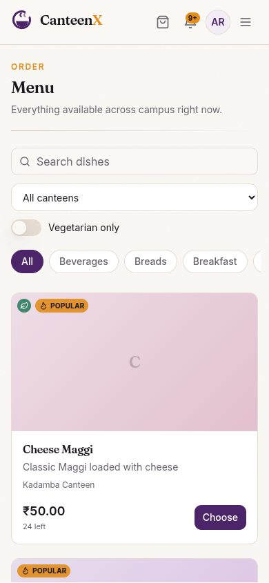
      <p align="center"><sub><b>Menu</b><br>390 x 844</sub></p>
    </td>
    <td width="22%" valign="top">
      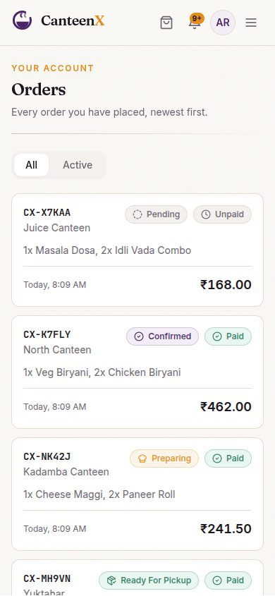
      <p align="center"><sub><b>Orders</b><br>390 x 844</sub></p>
    </td>
    <td width="46%" valign="top">
      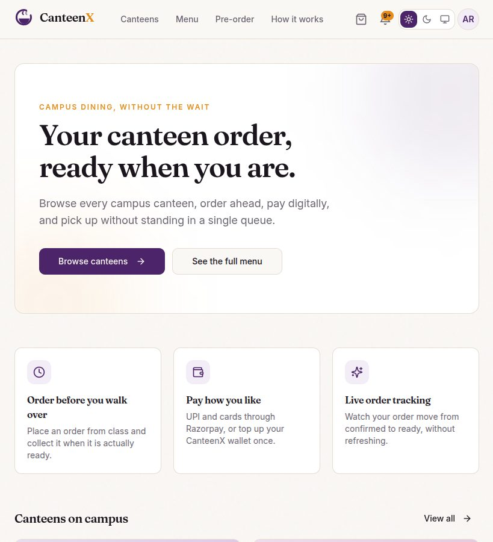
      <p align="center"><sub><b>Home</b><br>820 x 900</sub></p>
    </td>
  </tr>
</table>

## Features

- **Browse every canteen on campus** - live open/closed status derived from each canteen's weekly schedule (in campus local time, not UTC), ratings, search, and per-category filtering.
- **Real customization** - sizes, add-ons, spice levels and a note for the kitchen. Option prices are looked up server-side from the menu; the client only ever sends option ids, so a crafted request cannot change what an item costs.
- **One cart, on the server** - it follows you between phone and laptop, holds items from a single canteen, and tells you before checkout if something has sold out.
- **Payments that actually verify** - UPI and cards through Razorpay with server-side HMAC signature checking, plus a signed, idempotent webhook as the authoritative confirmation. Orders are never marked paid on a client's say-so. There is also an internal wallet for one-tap repeat orders.
- **Live order tracking** - the kitchen moves your order from confirmed to preparing to ready, and your screen updates over a WebSocket the moment it happens. No refreshing, no polling.
- **Notifications that reach you** - persisted server-side and pushed live, so a status change finds you even if the tab was closed when it happened.
- **Pre-orders and catering** - schedule a pickup time, or request a bulk order for an event and accept the canteen's quote.
- **Reviews and complaints** - both anchored to a real completed order, with a response flow the canteen and admins can work through.
- **Vendor console** - live order queue, menu management with image upload, server-backed stock counts, promo codes, catering quotes, and revenue analytics.
- **Admin console** - canteens, users and roles, complaint triage, and CSV-exportable reports.
- **Light and dark themes**, keyboard-navigable, and usable on a phone - including the vendor and admin consoles.

## Roles

| Role | Can do |
|---|---|
| **Student** | Browse, order, pay, track, review, complain, request catering |
| **Staff** | Everything a student can, plus run the queue and menu for canteens they are assigned to |
| **Vendor** | Owns a canteen: menu, stock, promotions, catering quotes, analytics, settings |
| **Admin** | Everything, plus canteens, user roles, complaint triage, and platform reports |

## The order lifecycle

1. **Browse** a canteen and add items, choosing any options.
2. **Checkout** - the server recalculates every price, applies any promo code, and reserves stock.
3. **Pay** by UPI, card, or wallet. Gateway payments are verified against Razorpay before the order is confirmed.
4. **Track** it live: `pending → confirmed → preparing → ready → completed`.
5. **Collect** using your order reference. Cancel inside the cancellation window and stock is returned automatically.

## Tech stack

- **Frontend**: React 18, TypeScript (strict), Vite, React Router, Apollo Client, Tailwind CSS v4, shadcn/ui
- **Backend**: FastAPI, Strawberry GraphQL, async SQLAlchemy 2.0, PostgreSQL, Alembic
- **Real-time**: GraphQL subscriptions over `graphql-ws`, with a pub/sub interface that runs in-process or on Redis
- **Payments**: Razorpay, with signature verification and idempotent webhooks
- **Storage**: self-hosted object storage, proxied through the API so the upload key never reaches the browser
- **Auth**: JWT in httpOnly cookies with refresh-token rotation, CSRF double-submit, argon2 hashing, and CAS single sign-on
- **CI**: GitHub Actions - lint, type-check, migration drift check, and tests on every push and PR

## Project structure

```
backend/
├── app/
│   ├── api/          # GraphQL schema, REST endpoints, middleware, request context
│   ├── core/         # settings, database, security, logging, pub/sub
│   ├── db/models/    # SQLAlchemy models (snake_case columns only)
│   └── domain/       # services, pricing rules, payment gateway
├── alembic/          # migrations - the single source of schema truth
├── scripts/          # seed and end-to-end smoke script
└── tests/            # pytest suite, run against a throwaway database

frontend/
└── src/
    ├── components/   # brand, layout, shared primitives, menu, ui
    ├── graphql/      # operations, plus types generated from the live schema
    ├── lib/          # Apollo client, Razorpay loader, formatting helpers
    ├── pages/        # route-level pages (public, vendor, admin)
    └── stores/       # session state
```

## Notes on design

Money is stored and transported as an integer count of paise - never a float - so tax and discount arithmetic is exact. Order status, payment status, and roles are database enums with an explicit transition table, so an order cannot skip from pending to completed. Every GraphQL field declares an authorization policy, and a test fails the build if one is ever added without it.

## Getting started

Everything runs from one compose file. You need Docker, and nothing else.

```bash
git clone https://github.com/Dileepadari/CanteenX.git
cd CanteenX
docker compose up --build          # db, api on :8000, web on :8080
```

Migrations run as a release step before the API starts, so the schema is always current. Then seed:

```bash
docker compose exec api python -m scripts.seed
```

For running the pieces natively, environment variables and deployment, see **[DEVDOC.md](./DEVDOC.md)**.

### Demo accounts

The seed builds 4 canteens with full menus, promotions, and **one order in every status** so the order list, the kitchen queue and both dashboards have real data rather than empty states.

| Role | Email | Password |
|---|---|---|
| Admin | `admin@canteenx.dev` | `$SEED_PASSWORD` |
| Vendor | `vendor1@canteenx.dev` | `$SEED_PASSWORD` |
| Student | `student@canteenx.dev` | `$SEED_PASSWORD` |

`SEED_PASSWORD` defaults to `canteenx-dev-2026` in development and is read from the environment, never from a literal in the repository.

### Tests

```bash
cd backend
pytest                # 32 tests: ordering, payments, authorization, regressions
```

## Contributing

Issues and pull requests are welcome on [the repository](https://github.com/Dileepadari/CanteenX).

Before opening a PR, run what CI runs:

```bash
cd backend && ruff check . && ruff format --check . && mypy app && pytest
cd frontend && npm run lint && npm run typecheck && npm run build
```

Conventions: single-line commit messages, no em dashes and no literal emoji anywhere, and update `DEVDOC.md` in the same change if you add a model, a route or an environment variable.

Three rules worth knowing before touching the backend. **Every GraphQL field must name a permission class**, including `AllowAny`, so an unpoliced field is visible in review. **Prices are never taken from the client** - only option ids are, and their deltas are looked up in `app/domain/pricing.py`. And **Alembic is the only source of schema truth**; the app never creates a table, and CI fails on model/migration drift.

## License

[MIT](./LICENSE) © Dileep Adari
